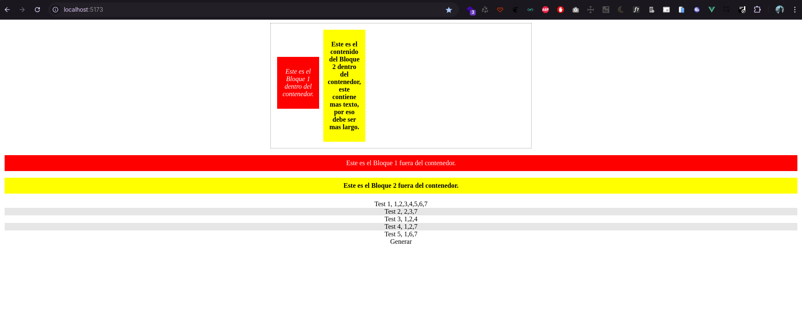
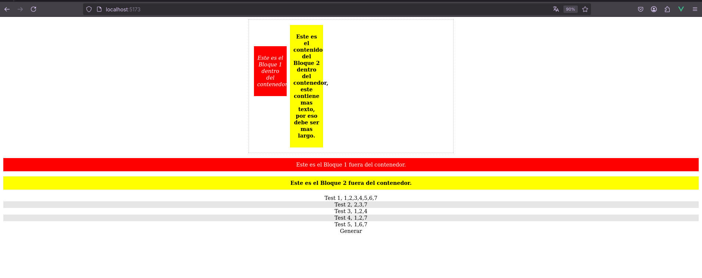
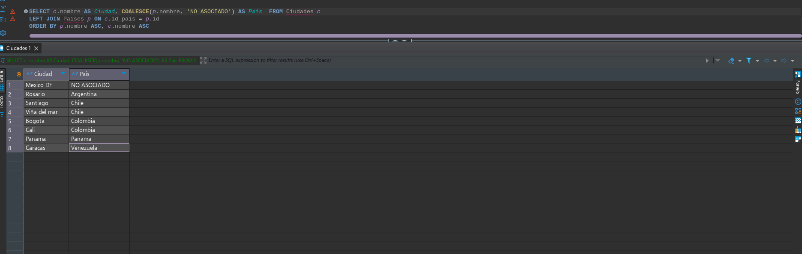

# Vue 3 + Vite

## Guía de instalación y uso

### Instalación

Para instalar el proyecto bastará con realizar una copia de esta teniendo cómo base el repositorio ubicado en la dirección

```
https://github.com/10075016-22/riservi-test
```
Dentro de esta ruta aparecerá una opción denominada `<> Code` que desplegará un menú donde se podrá copiar la url base para realizar el comando de clonación de Git

que puede ser con `HTTPS`

```
git clone https://github.com/10075016-22/riservi-test.git
```

o con `SSH`
```
git@github.com:10075016-22/riservi-test.git
```

Luego de haber clonado el repositorio en tu computadora, procedemos a abrir una terminal o el repositorio desde tu editor favorito y en la terminal ejecutaremos lo siguiente (ubicados dentro del proyecto)

```
npm i
```

Con esto instalaremos las dependencias para correr el proyecto.

Luego ejecutaremos

```
npm run dev
```

para correr en tu maquina en local.


**El proyecto está creado para ser trabajado en Vue3, pero dadas las pautas establecidas en el documento, el archivo** `HelloWorld.vue` **Se adaptó para esa situación**

### Información de la prueba CSS y HTML

Teniendo en cuenta el test, la secuencia para completar los datos es la siguiente.

1. Todos los textos del body estén centrados
2. El contenedor tenga un ancho fijo de 600px
3. El contenedor esté centrado horizontalmente
4. El contenedor debe tener un margen interno (padding) de 10px y un margin abajo de 10px
5. Agregar un borde de 1px (dotted o dashed) gris al contenedor.
6. El bloque 1 dentro del contenedor debe tener un ancho de 100px y un margen arriba de 70px
7. El bloque 2 dentro del contenedor debe tener un ancho de 100px purpura
8. Los bloques dentro del contenedor deben flotar hacia la izquierda con un margen de 5px
9. Los bloques fuera del contenedor no deben flotar
10. Agregar un div dentro del código html que utilice la clase “clear” ya definida para asegurar que el primer conjunto de bloques 1 y 2 queden dentro del borde del contenedor 
11. Los bloques 1 (dentro y fuera) deben tener fondo rojo, texto blanco hueso
12. Los bloques 2 (dentro y fuera) deben tener fondo amarillo, texto negro
13. El párrafo (`<p></p>`) del bloque1 dentro del contenedor debe aparecer en itálica.
14. El párrafo (`<p></p>`) del bloque2 dentro y fuera del contenedor debe aparecer en negrita.
15. Todos los párrafos (`<p></p>`) deben tener un margen interno de 10px (padding)





### Información prueba Vue JS

En el template html dentro del div con la clase 'v-container', generar un listado de divs con la data  del arreglo(array) 'myarray', que esta vacio, 
editar el array para que contenga 5 objetos, cada objeto con la siguientes propiedades : 'id' tipo entero, name: tipo string, roles: tipo array de enteros(minimo dos numeros en el array).  Ej de objeto

```js
{id:1, name:'Carlos', roles: [1,2] }
```
- En cada div generado imprimir la siguiente salida Nombre: "nombre del elemento" , roles : "string de los numeros de roles separados por comas"

- En cada div que sea de un elemento con indice impar agregarle un background gris  #e6e6e6, con binds de style o class  y ocultar los elementos con índice par.

- En el div con class btn , agregar un evento click de vue con una funcion que al hacer click genere una salida, en el dato output que es un string , en este string se edite, y se imprima en el div de clase 'output' de la siguiente manera 'el total de listado es: 'total', el resultado en total debe ser un dato o variable computada.


#### Solución

Se da resultado al manejo de mostrar los datos en el div `v-container` de la siguiente forma

```html
<div class="v-container">
  <div v-for="(item, index) in cmpArray" :key="index" :class="[index % 2 !== 0 ? 'bg-grey' : '']">
    {{ item.name }}, {{ item.rolesJoin}}
  </div>
</div>
```
donde cmpArray indica el array transformado bajo el uso de una variable `computed` la cual se genera de la siguiente forma:
A partir del array principal generamos este para poder mostrar los `roles` de la forma que se establece en el requerimiento (_separados por coma_), ahora bien, también podía haberse hecho directamente en el html dentro de `{{}}` lo cual es menos estetico

```js
cmpArray() {
  return this.myArray.map((oItem) => {
    return {
      name: oItem.name,
      rolesJoin: oItem.roles?.join(',')
    }
  })
}
```
Ahora, el evento `@click` para el `.btn` se hace de la siguiente manera 

```html
<div class="btn" @click="onGenerar">Generar</div>
<div class="output">
  {{ output }}
</div>
```

El evento `onGenerar` hará la magia, además le añadimos un detalle de cambiar el cursor a `pointer` al momento de pasar el mouse sobre este elemento.

```js
onGenerar() {
  this.output = `El total de listado es: ${this.cmpArray.length}`
}
```

Y esto actualizaría el valor de `output` añadiendo dentro de si, la cantidad de datos del array


___ 

### Prueba PHP

Dentro de este mismo documento comparto prueba de php

```php
function examen($iMin, $iMax, $aDatos) : bool{
	try {
		$bExamen = false;
		// Si $max es mayor que $min
		// manejamos double porque no sabemos si min o max son entero o tienen decimales
		if(doubleval($iMax) > doubleval($iMin)) $bExamen = true;

		// si ambos son ¡numeros ENTEROS de 1 a 3 dígitos! 
		$iDigitosMax = strlen((string) $iMax);
		$iDigitosMin = strlen((string) $iMin);
		if( ( $iDigitosMax >= 1 && $iDigitosMax <= 3 )  && ( $iDigitosMin >= 1 && $iDigitosMin <= 3 ) ) {
			$bExamen = true;
		}
		// si el array está vacio
		if(empty($aDatos)) {
			$bExamen = true;
		}
		
		
		return $bExamen;
	} catch (\Throwable $th) {
		return false;
	}
}
```

Algunas anotaciones para esto es lo siguiente:

1. Dadas las pruebas que tiene el archivo y al no poder modificar esas secciones, los parametros no pueden ser tipados de la forma 

```php
function examen(int $iMin, int $iMax, Array $aDatos)
```
porque solo correría un caso de prueba, así que tocó trabajarlo de forma natural, aquí mismo para poder comparar el min con el max usamos `doubleval` porque no sabemos que tipo de dato estamos tratando, un caso particular sería por ejemplo si min es 8.3 y max es 8.3, si usamos un int ambos serían iguales. 


___ 

### Prueba SQL

Para esta prueba tenemos que: 

Crear una única sentencia MySQL válida que liste TODAS las ciudades, y su respectivo país, ordenado por país ascendentemente y luego por ciudad ascendentemente. (Es una única sentencia MySQL con doble ordenamiento). 

- Utilizar sentenciaINNERJOIN adecuada.

El resultado debe tener la forma:

| Ciudad | Pais |
|--------|------|
| Ciudad | Pais |
| Ciudad | Pais |

#### Solución

Para esta solución se tiene cómo resultado lo siguiente

```sql
SELECT c.nombre AS Ciudad, COALESCE(p.nombre, 'NO ASOCIADO') AS Pais  FROM Ciudades c
LEFT JOIN Paises p ON c.id_pais = p.id
ORDER BY p.nombre ASC, c.nombre ASC
```

Teniendo en cuenta que si el país llega en `NULL` entonces mostraremos `NO ASOCIADO`

| Mexico DF    | NO ASOCIADO |
| Rosario      | Argentina   |
| Santiago     | Chile       |
| Viña del mar | Chile       |
| Bogota       | Colombia    |
| Cali         | Colombia    |
| Panama       | Panama      |
| Caracas      | Venezuela   |


Este sería el resultado de la consulta.

